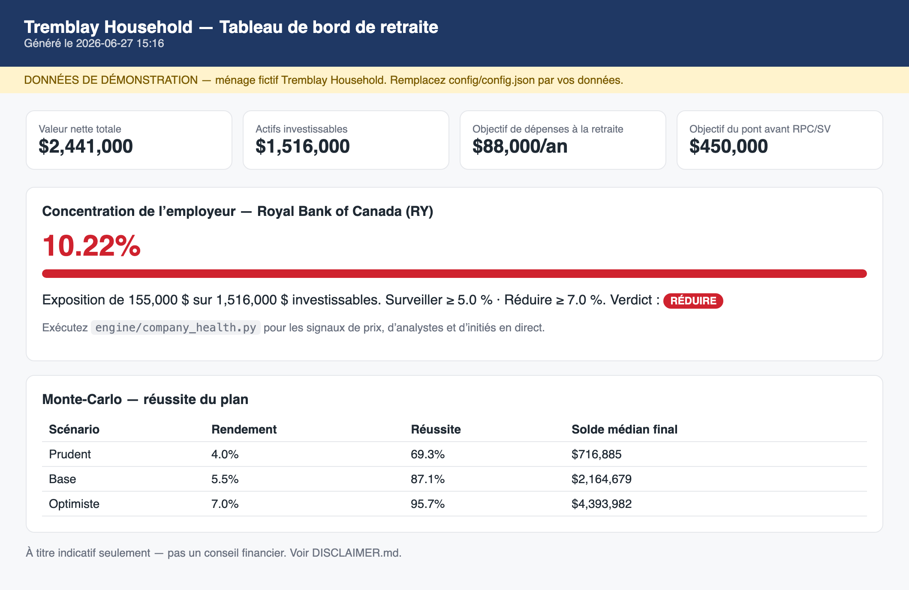

**Français** · [English](README.md)

# Trousse de planification de la retraite canadienne 🇨🇦


📖 **Documentation (EN/FR) :** <https://616fun.github.io/retirement-planning-toolkit-canada/>

Une trousse de planification de la retraite autogérée et pilotée par configuration pour le **Canada** : un modèle
de chiffrier multi-onglets, un moteur de Monte-Carlo, un tableau de bord HTML et un
**moniteur de santé de l'action de l'employeur** qui suit l'action de votre employeur afin d'éclairer les décisions
liées aux UAR (RSU) et à la concentration.

Elle modélise le système canadien de bout en bout — **REER (RRSP), CELI (TFSA), FERR (RRIF), CRI/FRV (LIRA/LIF), CELIAPP (FHSA),
REEE (RESP)**, **RPC (CPP) + SV (OAS)**, la **récupération de la SV**, la stratégie de **fonte du REER**, et
l'**impôt provincial** (indépendant de la province; livrée avec une démo de l'Ontario).

Elle est accompagnée d'une **démo fictive** complète (le « ménage Tremblay », Ontario)
afin que vous puissiez tout exécuter de bout en bout avant de saisir le moindre chiffre réel.

> **À titre indicatif seulement — ne constitue pas un conseil financier, fiscal ou en placement.** Voir
> [`DISCLAIMER.md`](DISCLAIMER.md). Les chiffres fiscaux et de prestations changent; vérifiez auprès de
> [canada.ca](https://www.canada.ca) avant d'agir.

> Adaptée de la [Retirement Planning Toolkit](https://github.com/616fun/retirement-planning-toolkit) américaine.
> Le moteur, le Monte-Carlo, le tableau de bord et le moniteur de santé d'entreprise sont partagés;
> toute la couche métier comptes/impôt/prestations a été reconstruite pour le Canada.



*Le tableau de bord sur le ménage fictif de la démo Tremblay (Ontario), en français — tuiles de
valeur nette, la cible du pont avant le RPC/SV, la concentration de l'action de l'employeur avec un
verdict OK / SURVEILLER / RÉDUIRE, et les taux de réussite Monte-Carlo.*

---

## Pourquoi cette trousse existe

La plupart des outils de planification sont soit des boîtes noires, soit des calculatrices génériques. Celle-ci est une
**fondation que vous possédez et que vous étendez** : toutes vos données vivent dans un seul fichier de configuration, la
logique est du Python lisible et clair, et les sorties (chiffrier + tableau de bord) vous
appartiennent et sont modifiables. La planification de la retraite canadienne a sa propre logique — la
récupération de la SV, la conversion obligatoire en FERR à 71 ans, le placement CELI-contre-REER, le fractionnement du revenu
de pension, la déclaration individuelle (et non conjointe) — et cette trousse l'encode directement.

## Ce qu'elle contient

| Composant | Fichier | Rôle |
|---|---|---|
| Chargeur de configuration | `engine/config_loader.py` | Un point de chargement unique + calculs dérivés (concentration, total investissable) |
| Moteur fiscal | `engine/tax_ca.py` | Fédéral + **les 10 provinces et 3 territoires** (incl. l'abattement de 16,5 % du Québec et le FSS) impôt sur le revenu + crédits de retraite + récupération de la SV; alimente l'optimiseur de fonte |
| Constructeur de modèle | `engine/build_model.py` | Génère le `.xlsx` multi-onglets à partir de la configuration |
| Santé d'entreprise | `engine/company_health.py` | Données de prix/analystes en direct → verdict UAR/réduction |
| Mise à jour trimestrielle | `engine/quarterly_update.py` | Reconstruction + Monte-Carlo 10k trajectoires + rafraîchissement du tableau de bord |
| Tableau de bord | `engine/refresh_dashboard.py` | HTML autonome avec ICP (KPI), concentration, MC |
| **Règles du Canada** | [`docs/CANADA_RULES.md`](docs/CANADA_RULES.md) | Référence sourcée : SV/RPC/SRG, paliers, plafonds REER/FERR/CELI/CELIAPP/REEE |
| Base de connaissances | `templates/KNOWLEDGE_BASE_TEMPLATE.md` | Un dossier structuré pour qu'un assistant IA dispose du contexte complet |
| Compétence d'entrevue | `skills/retirement-interview/` | Vous guide dans la construction de votre configuration + base de connaissances |

## Ce qui est modélisé (Canada)

| Concept | Où |
|---|---|
| Taxonomie des comptes **REER / CELI / FERR / CRI / CELIAPP / non enregistré** | `accounts` dans la configuration; onglet Valeur nette |
| **REEE** (exclu de la base investissable, comme un 529 américain) | `accounts.resp_a/b` |
| **RPC + SV** avec des âges de demande indépendants par conjoint | `government_benefits`; onglets Revenu + Année par année |
| **Récupération de la SV** comme plafond de revenu que vous planifiez | `assumptions.oas_clawback_threshold`; onglet Fonte du REER |
| **Optimiseur d'impôt à vie par fonte du REER** (l'analogue canadien d'une échelle de conversion Roth) | Onglet Fonte du REER — recherche la trajectoire de retrait qui minimise la valeur actuelle de l'impôt total à vie, y compris la disposition réputée terminale du REER au décès |
| Échéance de **conversion en FERR à 71 ans** | `assumptions.rrif_conversion_age`; Plan d'action |
| **Fractionnement du revenu de pension** (jusqu'à 50 %) | Plan d'action; base de connaissances |
| **Impôt provincial** | `household.province` — **les 10 provinces + 3 territoires encodés** (Québec incl. ses paliers, son MPI plus élevé, l'absence de surtaxe et l'abattement fédéral de 16,5 %); un code non reconnu revient à l'Ontario avec un avertissement |
| **RRQ** (Québec) | saisir dans les champs `cpp_monthly` — imposé comme le RPC; reportable jusqu'à 72 ans |

Voir [`docs/CANADA_RULES.md`](docs/CANADA_RULES.md) pour la référence complète et sourcée des paramètres,
y compris la carte des concepts États-Unis→Canada.

## Démarrage rapide

**Vous utilisez Claude Cowork ?** Voir [`INSTALL.md`](INSTALL.md) — connectez le dossier et
demandez à Claude d'exécuter `run setup.py --yes`. Aucun terminal requis.

**À partir d'un terminal** (macOS/Linux illustrés; Windows utilise `py` et les chemins `\` — voir
[`INSTALL.md`](INSTALL.md)). Fonctionne sous macOS, Linux et Windows; nécessite Python 3.9+.

```bash
# 1. Bootstrap -- checks Python, ASKS before installing deps, runs a smoke test
python3 setup.py
#    python3 setup.py --yes        # install without prompting (Cowork / CI)
#    python3 setup.py --check      # report status only
#    python3 setup.py --core-only  # skip the live-data libraries

# 2. Run the whole thing against the fictional demo (no real data needed):
python3 engine/build_model.py            # builds model/financial_plan.xlsx
python3 engine/quarterly_update.py       # Monte Carlo + dashboard
python3 engine/company_health.py         # live company-health for the demo ticker (RY)
open dashboard/dashboard.html

# 3. Make it yours:
cp config/config.example.json config/config.json
#    edit config/config.json with your numbers (it's git-ignored), then re-run
#    the commands above -- scripts auto-detect config/config.json. No env var needed.
python3 engine/quarterly_update.py
```

La configuration de démo se trouve à `config/examples/tremblay_config.json` (Ontario) et est
chargée automatiquement lorsqu'aucun `config/config.json` n'est présent. Une seconde démo,
`config/examples/gagnon_config.json`, est le **même ménage au Québec** (RRQ +
impôt du Québec + l'abattement) afin que vous puissiez voir l'effet de la province — exécutez-la avec :

```bash
RPT_CONFIG=config/examples/gagnon_config.json python3 engine/build_model.py
```

Tous les détails de l'installation (y compris la procédure pas à pas Cowork) se trouvent dans [`INSTALL.md`](INSTALL.md).

## L'angle santé d'entreprise

Si l'action de votre employeur (salaire + UAR + avoirs REER + pension) représente une grande part
de votre valeur nette — chose courante chez les employés des grandes banques, des télécoms et des
sociétés énergétiques canadiennes — il vous faut une façon reproductible de décider de **conserver ou de
diversifier** chaque acquisition d'UAR. `company_health.py` extrait des données de marché publiques pour votre
symbole boursier configuré et retourne un verdict `OK` / `WATCH` / `TRIM` par rapport à vos propres
seuils de concentration.

> **Note canadienne :** utilisez la **cote NYSE** des titres inscrits à la double cote (p. ex. `RY`,
> `SHOP`, `ENB`, `TD`) pour la meilleure couverture par Yahoo Finance. Le sous-signal d'initiés
> SEC-EDGAR est propre aux États-Unis — les émetteurs domiciliés au Canada ne produisent pas de
> formulaire 4 de la SEC, alors ce signal-là revient vide; le prix, les rendements et les cibles d'analystes fonctionnent toujours.
> Compte rendu complet dans [`docs/COMPANY_HEALTH.md`](docs/COMPANY_HEALTH.md).

## Sécurité / confidentialité

La dépersonnalisation est **structurelle** : aucune donnée personnelle ne se trouve dans le moindre script. Vos vrais
chiffres ne vivent que dans `config/config.json` et les artefacts générés, qui sont tous
ignorés par git. Avant tout commit, exécutez `git status` et confirmez qu'aucun des fichiers
ignorés n'est mis en index (staged). Ne committez jamais de relevés, de feuillets fiscaux (T4/T4A/T5), ni
quoi que ce soit correspondant à `*credentials*`.

## Docs
- [`docs/CANADA_RULES.md`](docs/CANADA_RULES.md) — référence sourcée des paramètres canadiens + carte États-Unis→Canada
- [`docs/ARCHITECTURE.md`](docs/ARCHITECTURE.md) — comment les pièces s'emboîtent
- [`docs/COMPANY_HEALTH.md`](docs/COMPANY_HEALTH.md) — le moniteur de l'action de l'employeur
- [`docs/QUARTERLY_WORKFLOW.md`](docs/QUARTERLY_WORKFLOW.md) — le rythme trimestriel
- [`docs/TESTING.md`](docs/TESTING.md) — la suite pytest et ce qu'elle couvre

## Licence
MIT — voir [`LICENSE`](LICENSE).
