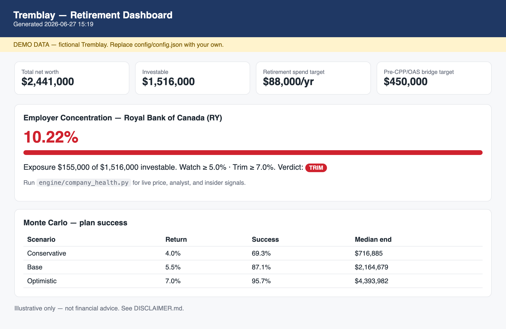

# Canadian Retirement Planning Toolkit 🇨🇦


A config-driven, self-managed retirement planning kit for **Canada**: a multi-tab
spreadsheet model, a Monte Carlo engine, an HTML dashboard, and an
**employer-stock health monitor** that tracks your employer's stock to inform RSU
and concentration decisions.

It models the Canadian system end to end — **RRSP, TFSA, RRIF, LIRA/LIF, FHSA,
RESP**, **CPP + OAS**, the **OAS clawback**, the **RRSP-meltdown** strategy, and
**provincial tax** (province-agnostic; ships with an Ontario demo).

It comes with a complete **fictional demo** (the "Tremblay household," Ontario)
so you can run the whole thing end to end before entering a single real number.

> **Illustrative only — not financial, tax, or investment advice.** See
> [`DISCLAIMER.md`](DISCLAIMER.md). Tax/benefit figures change; verify against
> [canada.ca](https://www.canada.ca) before acting.

> Adapted from the US [Retirement Planning Toolkit](https://github.com/616fun/retirement-planning-toolkit).
> The engine, Monte Carlo, dashboard, and company-health monitor are shared; the
> entire account/tax/benefit domain layer has been rebuilt for Canada.



*The dashboard on the fictional Tremblay demo household (Ontario) — net-worth
tiles, the pre-CPP/OAS bridge target, employer-stock concentration with an
OK / WATCH / TRIM verdict, and Monte Carlo success rates.*

---

## Why this exists

Most planning tools are either black boxes or generic calculators. This one is a
**foundation you own and extend**: all of your data lives in one config file, the
logic is plain readable Python, and the outputs (spreadsheet + dashboard) are
yours to modify. Canadian retirement planning has its own logic — the OAS
clawback, the age-71 RRIF wind-up, TFSA-vs-RRSP placement, pension income
splitting, individual (not joint) filing — and this toolkit encodes it directly.

## What's inside

| Component | File | Does |
|---|---|---|
| Config loader | `engine/config_loader.py` | One load point + derived math (concentration, investable total) |
| Tax engine | `engine/tax_ca.py` | Federal + **all 10 provinces & 3 territories** (incl. Quebec's 16.5% abatement & HSF) income tax + retirement credits + OAS clawback; powers the meltdown optimizer |
| Model builder | `engine/build_model.py` | Generates the multi-tab `.xlsx` from config |
| Company health | `engine/company_health.py` | Live ticker price/analyst data → RSU/trim verdict |
| Quarterly update | `engine/quarterly_update.py` | Rebuild + 10k-path Monte Carlo + dashboard refresh |
| Dashboard | `engine/refresh_dashboard.py` | Self-contained HTML with KPIs, concentration, MC |
| **Canada rules** | [`docs/CANADA_RULES.md`](docs/CANADA_RULES.md) | Sourced reference: OAS/CPP/GIS, brackets, RRSP/RRIF/TFSA/FHSA/RESP limits |
| Knowledge base | `templates/KNOWLEDGE_BASE_TEMPLATE.md` | A structured brief so an AI assistant has full context |
| Interview skill | `skills/retirement-interview/` | Walks you through building your config + knowledge base |

## What's modelled (Canada)

| Concept | Where |
|---|---|
| **RRSP / TFSA / RRIF / LIRA / FHSA / non-registered** account taxonomy | `accounts` in config; Net Worth tab |
| **RESP** (excluded from the investable base, like a US 529) | `accounts.resp_a/b` |
| **CPP + OAS** with independent claim ages per spouse | `government_benefits`; Income + Year-by-Year tabs |
| **OAS clawback** as the income ceiling you plan to | `assumptions.oas_clawback_threshold`; RRSP Meltdown tab |
| **RRSP-meltdown lifetime-tax optimizer** (the Canadian analog of a Roth-conversion ladder) | RRSP Meltdown tab — searches the withdrawal path that minimizes the present value of total lifetime tax, including the terminal RRSP deemed-disposition at death |
| **Age-71 RRIF conversion** deadline | `assumptions.rrif_conversion_age`; Action Plan |
| **Pension income splitting** (up to 50%) | Action Plan; knowledge base |
| **Provincial tax** | `household.province` — **all 10 provinces + 3 territories encoded** (Quebec incl. its brackets, higher BPA, no surtax, and the 16.5% federal abatement); an unrecognized code falls back to Ontario with a warning |
| **QPP** (Quebec) | enter in the `cpp_monthly` fields — taxed like CPP; deferrable to 72 |

See [`docs/CANADA_RULES.md`](docs/CANADA_RULES.md) for the full, sourced parameter
reference, including the US→Canada concept map.

## Quick start

**Using Claude Cowork?** See [`INSTALL.md`](INSTALL.md) — connect the folder and
ask Claude to `run setup.py --yes`. No terminal required.

**From a terminal** (macOS/Linux shown; Windows uses `py` and `\` paths — see
[`INSTALL.md`](INSTALL.md)). Runs on macOS, Linux, and Windows; needs Python 3.9+.

```bash
# 1. Bootstrap -- checks Python, ASKS before installing deps, runs a smoke test
python3 setup.py
#    python3 setup.py --yes        # install without prompting (Cowork / CI)
#    python3 setup.py --check      # report status only
#    python3 setup.py --core-only  # skip the live-data libraries

# 2. Run the whole thing against the fictional demo (no real data needed):
python3 engine/build_model.py            # builds model/financial_plan.xlsx
python3 engine/quarterly_update.py       # Monte Carlo + dashboard
python3 engine/company_health.py         # live company-health for the demo ticker (RY)
open dashboard/dashboard.html

# 3. Make it yours:
cp config/config.example.json config/config.json
#    edit config/config.json with your numbers (it's git-ignored), then re-run
#    the commands above -- scripts auto-detect config/config.json. No env var needed.
python3 engine/quarterly_update.py
```

The demo config lives at `config/examples/tremblay_config.json` (Ontario) and is
loaded automatically when no `config/config.json` is present. A second demo,
`config/examples/gagnon_config.json`, is the **same household in Quebec** (QPP +
Quebec tax + the abatement) so you can see the province effect — run it with:

```bash
RPT_CONFIG=config/examples/gagnon_config.json python3 engine/build_model.py
```

Full setup details (including the Cowork walkthrough) are in [`INSTALL.md`](INSTALL.md).

## The company-health angle

If your employer stock (salary + RSUs + RRSP holdings + pension) is a big part of
your net worth — common for employees of the big Canadian banks, telcos, and
energy names — you need a repeatable way to decide whether to **hold or
diversify** each RSU vest. `company_health.py` pulls public market data for your
configured ticker and returns an `OK` / `WATCH` / `TRIM` verdict against your own
concentration thresholds.

> **Canadian note:** use the **NYSE listing** of cross-listed names (e.g. `RY`,
> `SHOP`, `ENB`, `TD`) for the best Yahoo Finance coverage. The SEC-EDGAR insider
> sub-signal is US-specific — Canadian-domiciled issuers don't file SEC Form 4, so
> that one signal returns empty; price, returns, and analyst targets still work.
> Full write-up in [`docs/COMPANY_HEALTH.md`](docs/COMPANY_HEALTH.md).

## Safety / privacy

De-identification is **structural**: no personal data is in any script. Your real
numbers live only in `config/config.json` and the generated artifacts, all of
which are git-ignored. Before any commit, run `git status` and confirm none of the
ignored files are staged. Never commit statements, tax slips (T4/T4A/T5), or
anything matching `*credentials*`.

## Docs
- [`docs/CANADA_RULES.md`](docs/CANADA_RULES.md) — sourced Canadian parameter reference + US→Canada map
- [`docs/ARCHITECTURE.md`](docs/ARCHITECTURE.md) — how the pieces fit together
- [`docs/COMPANY_HEALTH.md`](docs/COMPANY_HEALTH.md) — the employer-stock monitor
- [`docs/QUARTERLY_WORKFLOW.md`](docs/QUARTERLY_WORKFLOW.md) — the quarterly rhythm
- [`docs/TESTING.md`](docs/TESTING.md) — the pytest suite and what it covers

## License
MIT — see [`LICENSE`](LICENSE).
